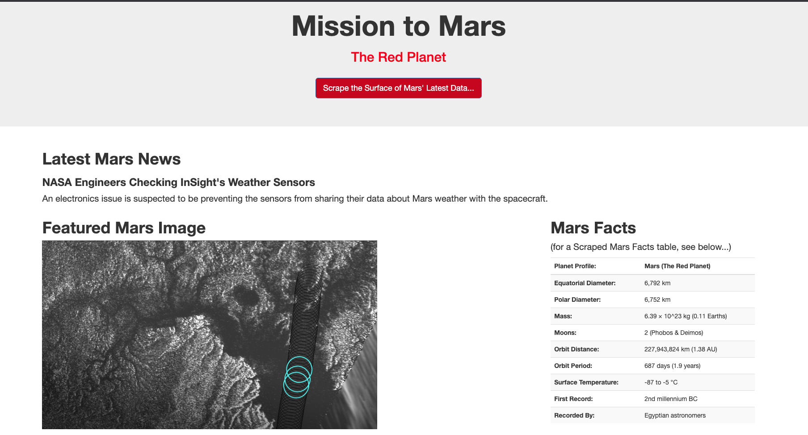
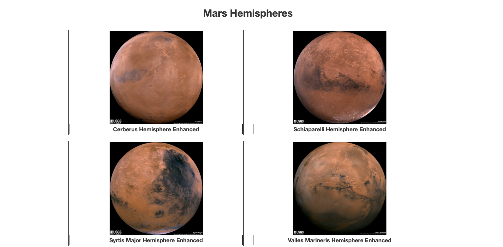

# Mission to Mars: Web-Scraping-Challenge
HW 10 in UCF Data Analytics &amp; Visualizations Bootcamp

In this assignment, the task was to build a Flask app that scraped different official Mars-related websites for data for our fictitious Mission to Mars and display the information in a single HTML page.

The following steps were followed in order to complete this objective:

## Scraping

### NASA Mars News

https://mars.nasa.gov/news/ website was used to get the latest NASA Mars news using BeautifulSoup, splinter, pandas in a jupyter notebook.

### JPL Mars Space Images - Featured Image

https://www.jpl.nasa.gov/spaceimages/?search=&category=Mars was used to scrape the featured image of mars in full resolution.

### Mars Facts

https://space-facts.com/mars/ to obtain a table containing facts about the Red planet including Diameter, Mass, etc.

### Mars Hemispheres

https://astrogeology.usgs.gov/search/results?q=hemisphere+enhanced&k1=target&v1=Mars to obtain high resolution images for each of Mar's hemispheres.

## Flask

* A python script to run all of the scraping code was designed and all of the scraped data was put into one Python dictionary.

* '/scrape' route which will import the Python script and call the scrape function was created.

## MongoDB:

* A new database and a new collection was created.

* All of the scraped data was stored in the above created database.

* Root route / that will query the database and pass the latest mars data into the HTML template was created.

## HTML file

An HTML file called 'index.html' was created that displayed all of the data in HTML elements.

## CSS file

A CSS file was created to add style elements to the HTML beyond the basic template provided (i.e make accents red)

